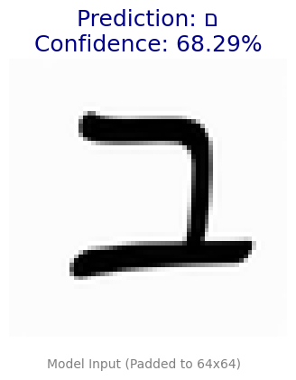

# hebrew-letters-ocr
A PyTorch-based Convolutional Neural Network (CNN) for recognizing Hebrew characters. Trained on synthetic data with online augmentations.

## 🚀 Optimization Journey: Handling Real-World Data

While the model achieved high accuracy on synthetic data, this project goes further to analyze its performance on real-world inputs and optimize accordingly.

### 🔍 Error Analysis: Handwritten vs. Printed Characters

A key finding was the model's sensitivity to handwriting variations (a phenomenon known as **Domain Shift**). Even after upgrading the inference pipeline to preserve the image aspect ratio using padding, the model still struggles with free-form handwriting compared to its absolute certainty on printed text.

| Example type | Model Output (Visualization) | Prediction & Confidence | Result |
| :--- | :---: | :---: | :--- |
| **Handwritten (ChatGPT Generated)** |  | **'ם' (Final Mem)** Confidence: 68.29% | **Failure ❌** |
| **Printed (Real World Screenshot)** |  | **'ב' (Bet)** Confidence: 100.00% | **Success ✅** |

**Conclusion:** The initial Convolutional Neural Network (CNN) successfully generalized to real printed data, achieving absolute mathematical certainty (100.00% confidence). However, the significant drop in confidence (68.29%) and incorrect prediction on the handwritten character confirms the domain gap. This proves that while the baseline model is robust for fonts, extending it to free-form handwriting requires specific datasets and Transfer Learning.
### 📊 Training Results: Final Confusion Matrix

After full training on the synthetic dataset, the model demonstrated robust performance. The Confusion Matrix below highlights its strong classification capabilities across all 27 classes, achieving an overall accuracy of **97.40%** on the validation set.

The matrix shows a nearly diagonal pattern, proving high precision for most Hebrew characters. Minimal confusion remains for similar-looking characters (e.g., 'Nun' vs. 'Gimel'), which provides insights for future optimizations.
