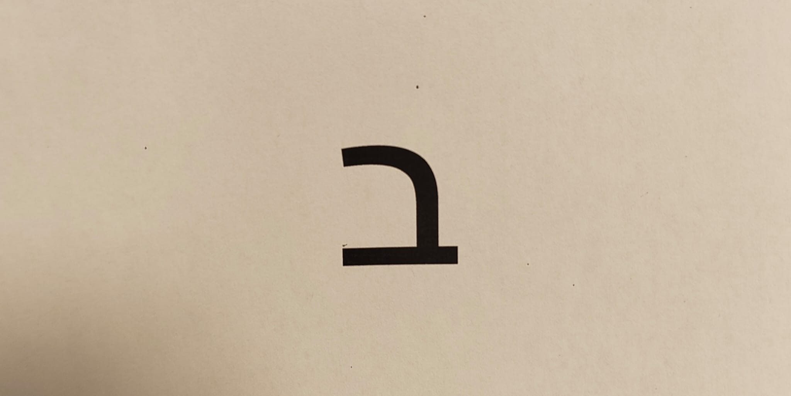
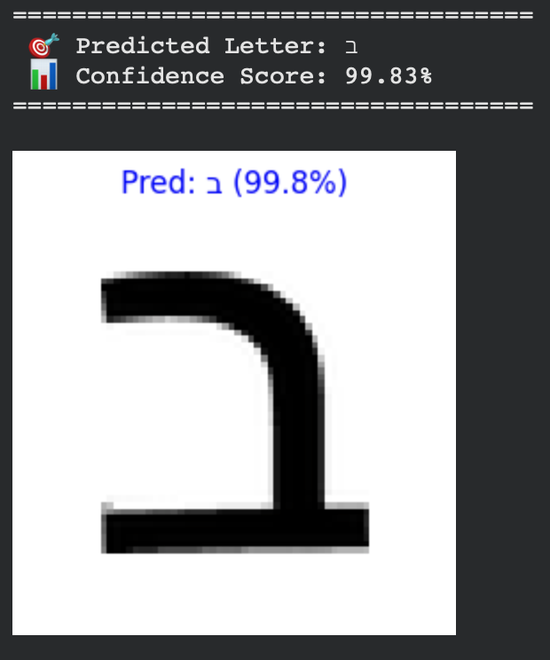
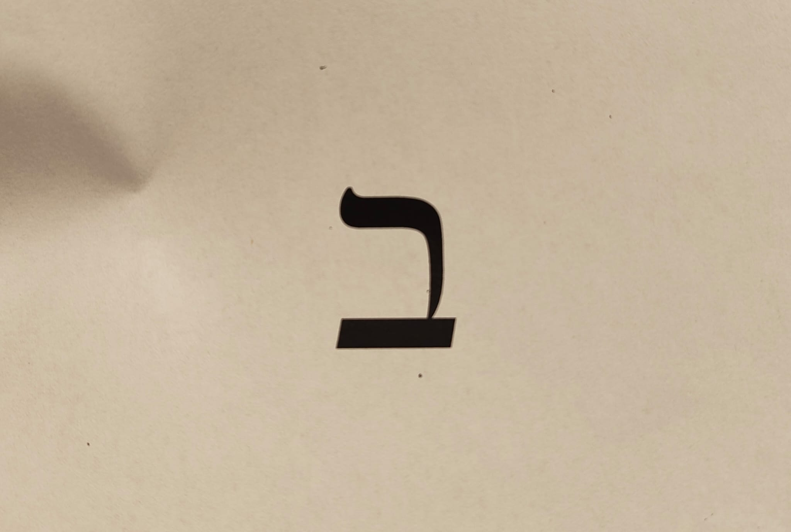
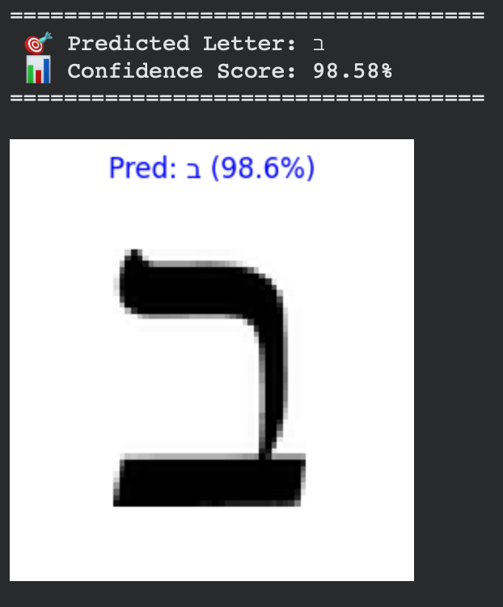
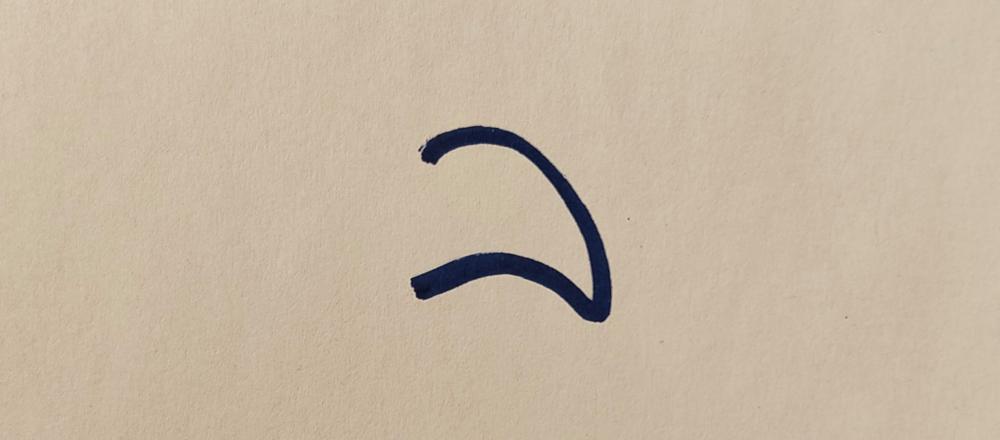
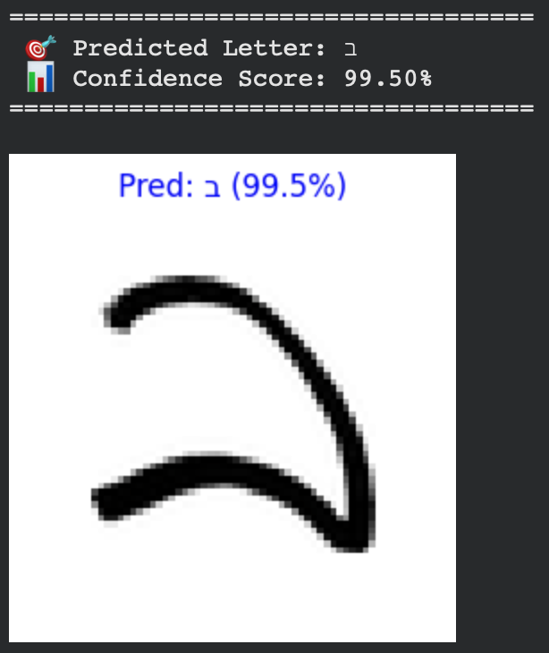
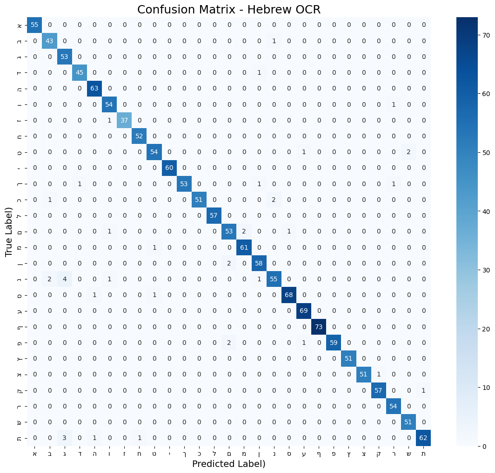

# Hebrew Characters OCR

A PyTorch-based Convolutional Neural Network (CNN) for recognizing Hebrew characters. The model was initially trained on synthetically generated Hebrew characters (using multiple fonts and randomized augmentations) and later optimized for real-world robustness.

## ✨ Key Features
* **Sim-to-Real Pipeline:** Bridges the gap between synthetic training data and real-world, noisy camera images.
* **Advanced Preprocessing:** Uses OpenCV contour detection for dynamic binarization and automatic cropping based on contour detection.
* **Robust to Variations:** Combats "shortcut learning" through aggressive affine augmentations (scale and rotation).
* **Detailed Error Analysis:** Includes an in-depth breakdown of the confusion matrix and known limitations (e.g., the Auto-Cropping paradox).

## 🧠 Model Architecture
* **Framework:** PyTorch
* **Input:** 64x64 Grayscale images
* **Layers:**
  * 2× Convolutional Layers (32 & 64 filters, 3×3 kernel, padding=1) + ReLU + MaxPool2d
  * 1× Fully Connected (Linear) Layer
* **Output:** 27 classes (Hebrew alphabet, including final letters)

## 🚀 Optimization Journey: Bridging the Sim-to-Real Gap

While the baseline model achieved high accuracy on clean, synthetic data, it initially struggled with real-world camera photos due to background noise, scale variations, and domain shifts in handwriting styles. To solve this, the pipeline was systematically improved:

1. **Robust Training (Defeating Shortcut Learning):** Added aggressive scale variations (`0.7` to `1.2`) and rotations (`±15°`) over 50 epochs. This forced the CNN to learn meaningful shape features rather than relying on pixel-count shortcuts.
2. **Advanced Inference Pipeline:** Integrated OpenCV (`cv2`) for dynamic binarization and auto-cropping via contour detection. This preprocessing step extracts the foreground character and centers it to better match the training distribution.

**The Result:** The model now produces highly confident and correct predictions on the tested real-world samples shown below, successfully generalizing to both printed fonts and free-form handwriting.

### 📸 Real-World Camera Tests

| Input Type | Raw Camera Photo | Model Output (Binarized & Auto-Cropped) | Result |
| :--- | :---: | :---: | :--- |
| **Printed (Arial)** |  |  | **Success ✅**<br>(98.11% confidence) |
| **Printed (Times New Roman)** |  |  | **Success ✅**<br>(99.77% confidence) |
| **Handwritten (Real Pen & Paper)** |  |  | **Success ✅**<br>(99.80% confidence) |

---

### 📊 Training Results: The Confusion Matrix

After training for 50 epochs with heavy augmentations, the validation accuracy settled at **88.82%**. While numerically lower than the 97.40% achieved on early clean data, this matrix represents a more robust model better suited for real-world inputs.



**🔍 Error Analysis & Known Limitations (Auto-Cropping Effect):**
The matrix reveals that the model's mistakes are highly logical visual confusions, largely caused by the normalization process itself:

* **'ן' (Final Nun) vs. 'ו' (Vav):** Because Auto-Crop resizes every isolated letter to a uniform 64x64 box, the relative height difference between these vertical lines is lost. 
* **'ך' (Final Khaf) vs. 'ר' (Resh):** Similarly, shrinking the long leg of the 'ך' to fit the bounding box makes its upper right angle visually identical to a 'ר'.
* **'כ' (Khaf) vs. 'נ' (Nun):** With the addition of ±15° rotation during training, a tilted 'כ' mathematically resembles the curved belly of a 'נ'.

**Conclusion:** The CNN successfully generalized to free-form handwriting and raw camera inputs. Future improvements could include context-aware predictions (e.g., sequence modeling with RNNs or Transformers) to address single-character ambiguities.

---

## 🛠️ Usage

Test the model on your own images using the command line:

```bash
# 1. Install requirements
pip install torch torchvision Pillow matplotlib opencv-python numpy

# 2. Run inference on a local image
python predict.py --image path/to/your_image.jpg --model hebrew_ocr_augmented.pth
```
