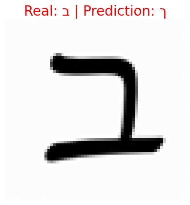
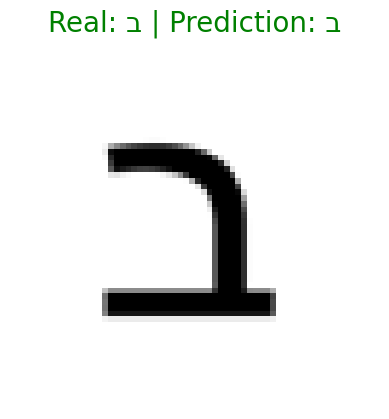

# hebrew-letters-ocr
A PyTorch-based Convolutional Neural Network (CNN) for recognizing Hebrew characters. Trained on synthetic data with online augmentations.

## 🚀 Optimization Journey: Handling Real-World Data

While the model achieved high accuracy on synthetic data, this project goes further to analyze its performance on real-world inputs and optimize accordingly.

### 🔍 Error Analysis: Handwritten vs. Printed Characters

A key finding was the model's sensitivity to handwriting variations (a phenomenon known as **Domain Shift**).

| Example type | Input Image | Model Prediction | Result |
| :--- | :---: | :---: | :--- |
| **Handwritten (ChatGPT Generated)** |  | **'ך' (Final Kaf)** | **Failure ❌** |
| **Printed (Real World Screenshot)** |  | **'ב' (Bet)** | **Success ✅** |

**Conclusion:** The initial Convolutional Neural Network (CNN) successfully generalized to real printed data but required further tuning (like Transfer Learning or specific handwritten datasets) to reliably recognize free-form handwriting.

### 📊 Training Results: Final Confusion Matrix

After full training on the synthetic dataset, the model demonstrated robust performance. The Confusion Matrix below highlights its strong classification capabilities across all 27 classes, achieving an overall accuracy of **97.66%** on the validation set.

The matrix shows a nearly diagonal pattern, proving high precision for most Hebrew characters. Minimal confusion remains for similar-looking characters (e.g., 'Bet' vs. 'Nun'), which provides insights for future optimizations.
